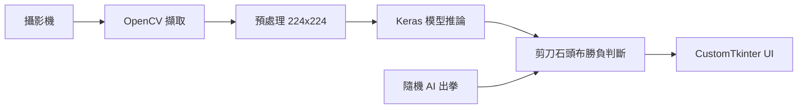

# project01 — 剪刀石頭布 AI 遊戲

> 早期練習作品：用攝影機 + Teachable Machine 模型玩剪刀石頭布的桌面小程式

**Author**: [@Lee-unhn](https://github.com/Lee-unhn) · a2264563@gmail.com
**Status**: Early Project

## 簡介

這是早期接觸 AI 時的練習專案。使用 Python + CustomTkinter 做 GUI、OpenCV 抓攝影機影像、TensorFlow/Keras 載入 Teachable Machine 訓練的模型做手勢辨識，跟一個隨機出拳的 AI 對戰剪刀石頭布。

屬於學習過程的成果之一，不是長期維護的專案。

## 架構

## 主要檔案

- `README.md` — 專案說明
- `readone` — 早期筆記檔

（原始開發結構包含 `ui/app.py`、`game_logic/rps_game.py`、`camera_utils/camera_stream.py`、`models/keras_model.h5`，repo 目前僅保留 README。）

## 備註

早期學 AI / Python GUI 的練習作。模型路徑為硬編碼，僅用於個人本機測試，不建議直接 clone 使用。
